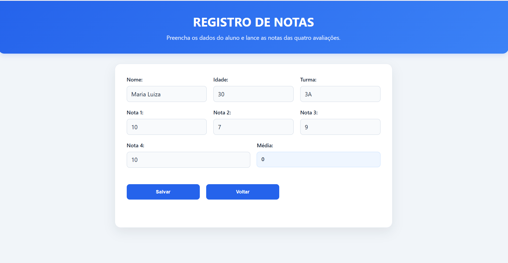
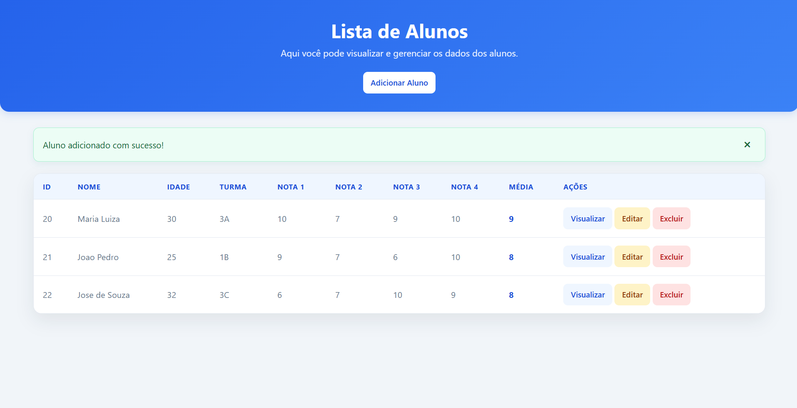
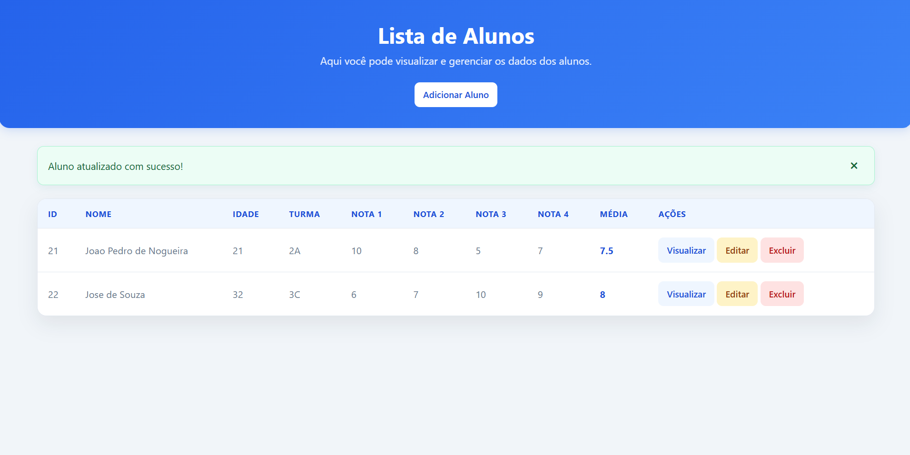
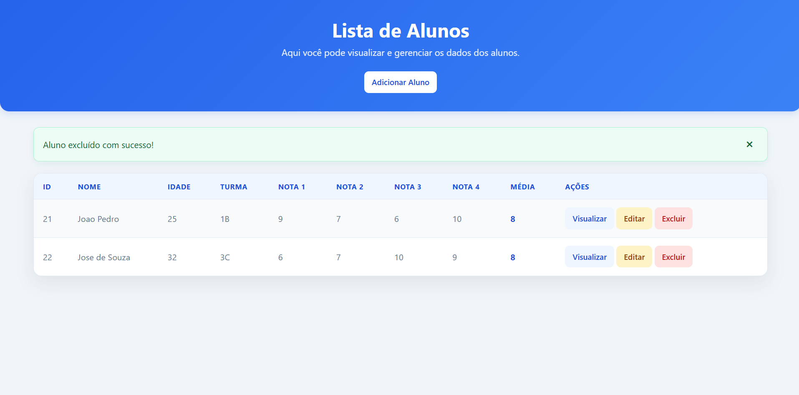

# Registro de Alunos

Aplicação web em PHP para cadastro e gerenciamento de alunos e suas notas. O projeto implementa as operações CRUD (criar, consultar, atualizar e excluir) usando PHP, MySQL e a extensão MySQLi.

## Visão geral

O sistema permite:

- cadastrar nome, idade, turma e quatro notas;
- calcular automaticamente a média das quatro avaliações;
- visualizar a lista completa de alunos;
- consultar os dados de um aluno individualmente;
- atualizar os dados e as notas de um aluno;
- excluir um aluno após confirmação;
- exibir mensagens de sucesso ou erro após as operações.

A média é calculada no servidor pela fórmula:

```text
média = (nota1 + nota2 + nota3 + nota4) / 4
```

## Tecnologias usadas

- **PHP**: páginas dinâmicas e regras do CRUD;
- **MySQL**: armazenamento dos dados;
- **MySQLi**: conexão e consultas ao banco;
- **HTML5**: estrutura das telas e formulários;
- **CSS3**: layout responsivo e estilos da aplicação;
- **WampServer**: ambiente local sugerido para Apache, PHP e MySQL;
- **Git**: controle de versão.

O projeto não usa framework PHP nem dependências instaladas por Composer ou npm.

## Estrutura de arquivos

```text
crud-registro-alunos/
├── acoes.php                    # Insere, atualiza e exclui alunos
├── adicionar.php                # Formulário de novo aluno
├── editar.php                   # Formulário para editar um aluno
├── index.php                    # Lista todos os alunos
├── mensagem.php                 # Exibe mensagens da sessão
├── visualizar.php               # Consulta detalhada de um aluno
├── README.md
├── assets/
│   ├── css/
│   │   ├── style-adicionar.css # Estilos dos formulários
│   │   ├── style-lista.css     # Estilos da lista e ações
│   │   └── style-visualizar.css# Estilos da consulta detalhada
│   └── img/
│       ├── atualizado.png      # Exemplo de atualização concluída
│       ├── excluido.png        # Exemplo de exclusão concluída
│       ├── lista.png           # Exemplo da lista de alunos
│       └── registrar.png       # Exemplo do cadastro
├── banco/
│   └── registro_alunos.sql      # Criação do banco e da tabela
└── config/
	└── conexao.php              # Configuração da conexão MySQL
```

## Banco de dados

O arquivo [banco/registro_alunos.sql](banco/registro_alunos.sql) cria o banco `registro_alunos` e a tabela `alunos` com os seguintes campos:

| Campo | Tipo | Descrição |
| --- | --- | --- |
| `id` | `INT` | Identificador único e auto-incremental |
| `nome` | `VARCHAR(100)` | Nome do aluno |
| `idade` | `INT` | Idade do aluno |
| `turma` | `VARCHAR(100)` | Turma do aluno |
| `nota1` a `nota4` | `FLOAT` | Notas das quatro avaliações |
| `media` | `FLOAT` | Média calculada pelo sistema |

### Configuração com phpMyAdmin

1. Inicie os serviços **Apache** e **MySQL** no WampServer.
2. Abra o phpMyAdmin em `http://localhost/phpmyadmin`.
3. Acesse a opção **Importar**.
4. Selecione [banco/registro_alunos.sql](banco/registro_alunos.sql).
5. Execute a importação e confirme a criação do banco `registro_alunos` e da tabela `alunos`.

Também é possível executar o conteúdo do arquivo diretamente no cliente MySQL:

```sql
SOURCE banco/registro_alunos.sql;
```

## Configuração da conexão

Por padrão, [config/conexao.php](config/conexao.php) usa:

```php
$host = "localhost";
$usuario = "root";
$senha = "";
$banco = "registro_alunos";
```

Esses valores correspondem à configuração padrão do WampServer. Se o MySQL local usar outro usuário, senha, host ou porta, ajuste o arquivo antes de iniciar a aplicação.

## Como rodar localmente

### Usando WampServer

1. Copie ou mantenha esta pasta em `C:\wamp64\www\crud-registro-alunos`.
2. Inicie o WampServer e aguarde o ícone ficar verde.
3. Garanta que o banco foi criado conforme a seção anterior.
4. Confira as credenciais em [config/conexao.php](config/conexao.php).
5. Abra no navegador:

   ```text
   http://localhost/crud-registro-alunos/
   ```

6. A página inicial exibirá a lista de alunos e o botão **Adicionar Aluno**.

### Usando o servidor embutido do PHP

Com o banco MySQL em execução, abra um terminal na raiz do projeto e execute:

```bash
php -S localhost:8000
```

Depois, acesse:

```text
http://localhost:8000/
```

## Fluxo de uso

### 1. Criar um aluno

Na página inicial, clique em **Adicionar Aluno**, preencha nome, idade, turma e as quatro notas e selecione **Salvar**. O sistema calcula a média, grava o registro no banco e redireciona para a lista.



### 2. Mostrar a lista de alunos

A página inicial (`index.php`) consulta a tabela `alunos` e apresenta ID, dados pessoais, notas, média e ações disponíveis. Em telas menores, a tabela se adapta para o formato de cartões.



### 3. Atualizar um aluno

Na lista, clique em **Editar**. O formulário será preenchido com os dados atuais. Altere as informações necessárias e clique em **Salvar**. A média será recalculada e o registro será atualizado.



### 4. Excluir um aluno

Na lista, clique em **Excluir** e confirme a operação no navegador. O registro será removido da tabela e uma mensagem de confirmação será exibida.



## Rotas e responsabilidades

| Arquivo | Responsabilidade |
| --- | --- |
| `index.php` | Lista os alunos e oferece as ações CRUD |
| `adicionar.php` | Exibe o formulário de cadastro |
| `visualizar.php?id=ID` | Exibe os dados de um aluno específico |
| `editar.php?id=ID` | Exibe o formulário de edição |
| `acoes.php` | Processa requisições `POST` de criação, edição e exclusão |
| `mensagem.php` | Mostra e limpa mensagens armazenadas na sessão |
| `config/conexao.php` | Abre a conexão com o MySQL |

## Validações atuais

- Nome e turma são obrigatórios.
- A idade mínima aceita pelos formulários é 15 anos.
- As notas são obrigatórias e devem estar entre 0 e 10.
- A média é calculada novamente ao criar ou editar um aluno.
- A exclusão exige confirmação no navegador.

## Observações

- O projeto espera que o banco MySQL esteja disponível antes do acesso às páginas PHP.
- As páginas referenciam `assets/js/script.js` e alguns formulários também referenciam `assets/css/style.css`; esses arquivos não estão presentes na estrutura atual do projeto. A aplicação pode continuar exibindo os estilos principais, mas os recursos desses caminhos não serão carregados até que sejam adicionados ou que as referências sejam removidas.
- Para uso em produção, recomenda-se trocar consultas SQL concatenadas por prepared statements, reforçar a validação no servidor e configurar proteção contra CSRF e credenciais fora do código-fonte.

## Licença

Não foi definida uma licença no repositório. Consulte o responsável pelo projeto antes de redistribuir ou reutilizar o código.
